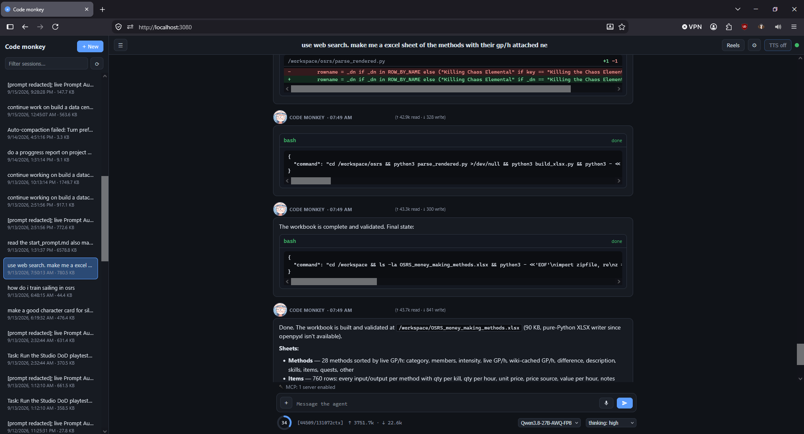

# Pi Agent WebUI

A browser UI for the [pi coding agent](https://github.com/badlogic/pi-mono) running headless (`pi --mode rpc`) inside a Docker container on Windows 10.
early Work.in.progress (will have bugs)


```
Browser  ──WebSocket/HTTP──▶  bridge (Node.js)  ──stdin/stdout JSONL──▶  pi --mode rpc
     (web/ static files)         (bridge/server.js)         (inside the container)
```

A single `pi --mode rpc` subprocess is shared by every connected client; every pi RPC command is relayed to it and every event is broadcast back to all of them, so the full agent protocol (streaming, tools, bash, extensions) works — and the browser UI, the desktop app and any other window stay in lockstep in real time instead of drifting apart.

## Features

| Feature | How it works |
|---|---|
| **Command use** | `/` opens a slash-command menu built from pi's `get_commands` (extension commands, prompt templates, `skill:` commands) **plus every pi built-in command** (`/compact`, `/new`, `/model`, `/thinking`, `/copy`, …) auto-loaded from the installed pi package — so new commands pi adds in future releases appear automatically. Built-ins with a direct RPC (`/compact`, `/new`, `/name`, `/model`, `/thinking`, `/clone`, `/copy`, `/session`) run natively in the WebUI; the rest are sent to the agent. Shell access: type `!ls -la` to run a bash command in the container via pi's `bash` RPC (output streams live). |
| **Stop generation** | A **Stop** button appears next to the (always visible) Send button while the agent is generating — click it to abort the current turn. Esc also clears the queue and aborts. |
| **Live context ring** | The context ring in the top bar shows the % used and a `[used/max]ctx` label (e.g. `[54000/131072ctx]`). It updates **live while the agent is streaming** (polled every second) and on session switch — not just when you switch sessions and back. |
| **Compaction** | `/compact` (or the ring) compacts the session. Right after a compaction the ring and label show `–` instead of a number, because the agent reports no context size until the next LLM response. |
| **Upload images** | 📎 button or drag & drop anywhere; sent as base64 image blocks on the `prompt` command. |
| **Paste images from clipboard** | Ctrl+V an image anywhere on the page — it becomes an attachment preview above the composer. |
| **Editing session text** | Hover a user message → ✏️. The text loads into the composer; sending uses pi's `fork` RPC to branch the session from that exact message and prompts with your edited text. |
| **Switching sessions** | Sidebar lists all sessions found in the pi session dir (from `/api/sessions`); click to `switch_session`, filter box, ⟳ refresh, `+ New` starts a new session, click the title bar name to rename (`set_session_name`). |
| **Voice to text** | 🎙 button uses the browser's own speech recognition by default (Chrome/Edge; `localhost` is a secure context, so no HTTPS needed) — nothing to download. A local whisper.cpp server is the opt-in alternative: pick a model (Tiny 75 MB / Base 142 MB / Small 466 MB / Large v3 multilingual 3.1 GB, each with a note on speed vs accuracy; the list is fetched even while browser voice is selected, so the choice is there when you switch) and clicking the mic starts it automatically with the selected model — first use downloads it, *download & start* in settings does it up front. If it cannot start, browser voice takes over. Speech fills the composer — review, then send manually, or enable **auto-send** (settings ⚙ or `/autosend`) for hands-free sending. |
| **TTS for agent output** | `TTS` toggle in the header (or `/tts`) auto-speaks every assistant reply via `speechSynthesis`; every assistant message also has a 🔊 button. Pick the Windows voice and speech rate in settings ⚙ (with a test button). Esc stops playback. |
| **Agent identity** | Rename the agent and give it a profile image in settings ⚙ — both show next to its messages, and the image also sits top-left in the sidebar. There is no built-in placeholder: with no image set, only the name shows, and **clear** removes it everywhere. The image can be a still, a GIF or a video, and either can be **cropped by hand** (settings → crop…: the whole picture is shown with the crop frame over it, so you can see what you are cutting off — drag to move, scroll or the slider to zoom, and the dimmed area is what goes away). Its size is adjustable too. |
| **Readable over anything** | Chat text is outlined (a 1px shadow around every glyph) so it stays legible when the panels are translucent and a background image or video shows through — the outline colour comes from settings, and it can be switched off. **Chatbox transparency** fades the composer, sidebar, message bubbles, tool cards, bash/system output, code blocks and the model/thinking controls together, with a real backdrop blur behind them, and **background transparency** fades the image/GIF/video on its own (a bright photo is often too much at full strength even with the panels clear). Backgrounds get the same manual crop as the profile image, and a background **video's audio** can be played with its own volume — the browser only allows sound after you have clicked the page once, so it starts on the first click. |
| **Typing** | Optional **type anywhere**: with it on, any keystroke while the window is focused lands in the composer without clicking it first. |
| **Pi extensions integration** | Full `extension_ui_request` sub-protocol in the browser: `select`/`confirm`/`input`/`editor` dialogs become native modals, `notify` → toasts, `setStatus`/`setWidget` → status & widget bars above the composer, `setTitle` → tab title, `set_editor_text` → composer. Extension-registered slash commands appear in the `/` menu. |

| **Instances** | The agent's face at the top of the sidebar is the switcher: it lists the pi agents you use — this one plus any others you add (another machine, another port) — each with its own picture and a green pulsing dot while that agent is working. Picking one **keeps you on this page**: the local bridge fetches for you (`/proxy/<origin>/…`, WebSocket included), so sessions, chat and models are that machine's while the UI, its settings and the switcher stay yours. If that host is off you get a banner saying so and a way back, instead of a dead end. Right-click an instance to remove it from the list or open its own page. |
| **Sessions started from a session** | A forked branch or a subagent that kept working in the background is not another line in the sidebar. The parent shows `⑃ N`, and the same menu sits next to the session name in the session bar — one click to see them, one to open one. |
| **When the agent finishes** | A turn can end while you are looking at another window. Settings → General: play a short chime, show a desktop notification, and "only when this window is not focused" (on by default). |
| **Gamer mode** | Settings → Appearance: the theme colour drifts through the rainbow, one full turn every 16 seconds — fast enough to notice, slow enough to read over. Every accent-coloured thing follows it, scrollbars included. |
| **Mobile and narrow windows** | Under 760px the sidebar becomes a drawer over the chat (☰ opens it, tapping the conversation closes it), the topbar wraps instead of squeezing the session name between buttons, the stats row wraps instead of overlapping, and dialogs go edge to edge. Anything tappable gets a real touch target. |
| **Right-click menus** | On a session: open, **export…** (a real "save where you want" dialog), **branches…** (jump to a fork point) and **delete…** (asks first). On a message: **fork from here** — starts a new branch at that turn — plus copy and speak. Same look as the model picker. |

Extras: streaming markdown rendering (code blocks, thinking collapse, live tool-call cards), model & thinking-level pickers (the model list is searchable and scrolls, however many you have), session stats (context %, cost, tokens/sec that stay on screen after the turn ends), queue display with steer/follow-up, Esc to clear-queue + abort, agent crash banner with one-click restart.

## Run it

> This machine runs Forgejo on port 3000, so the WebUI uses **http://localhost:3080**.

There are three ways in: the **browser UI** (`start-webui.bat`), the same UI in **its own window** with no build step (`start-app-window.bat`, Edge/Chrome app mode), or the **native Windows app** (`start-app.bat`, source in `pi-desktop/`).

### Choosing the agent source (first run)

`start-webui.bat` asks once whether your pi agent runs natively on Windows or in a Docker container, and (for Docker) lists your containers so you pick the right one — no name hardcoded. The answer is saved to `bridge/agent-source.txt` and reused afterwards. Run `switch_pi_agent_source.bat` at any time to erase that choice and pick again.

### Your setup: attach to the existing pi agent container (recommended)

Your pi agent lives in the `heuristic_varahamihira` container (image `buildadatacenter`, pi home in the `pi-agent-datacenter-home` volume, workspace `C:\Users\dambi\Downloads\projects\ai\build_a_datacenter`). pi's RPC protocol is stdio-only — it cannot be reached over the network — so the bridge attaches to that exact container with `docker exec -i`:

```powershell
start-webui.bat        # or manually:
cd bridge
set PI_COMMAND=docker exec -i heuristic_varahamihira pi --mode rpc
set PI_SESSION_DIR=docker:heuristic_varahamihira:/root/.pi/agent/sessions
set PORT=3080
npm install && npm start
```

The agent keeps everything (model config, API endpoints, extensions, MCP servers, sessions) inside its own container — the bridge only shuttles JSON. Session listing, switching, and forking work against the container's `~/.pi/agent/sessions` via the `docker:<container>:<path>` form of `PI_SESSION_DIR`. Extension commands (`/subagents`, `/mcp`, `/council`, …) and extension UI events (MCP status bar, widgets, dialogs) come straight from your agent. Requires the container to be running: `docker start heuristic_varahamihira`.

### Alternative: dedicated container with pi bundled

```powershell
docker compose up -d --build
```

Builds a container with the pi CLI installed inside and serves on 3080, workspace mounted from `./workspace`. Connect it to a provider by putting `ANTHROPIC_API_KEY=...` / `OPENAI_API_KEY=...` etc. in `.env` next to `docker-compose.yml`, or reuse an existing pi home by replacing `- pi_data:/root/.pi` with `- ${USERPROFILE}\.pi:/root/.pi` in `docker-compose.yml`.

```powershell
$env:PI_WEBUI_PORT=3090; docker compose up -d --build   # when 3080 is taken
docker compose build --build-arg PI_PACKAGE=@mariozechner/pi-coding-agent
```

The host port is `PI_WEBUI_PORT` (default 3080) so a container and a native bridge can share the machine. The image installs `@earendil-works/pi-coding-agent` by default — override with `--build-arg PI_PACKAGE=… --build-arg PI_VERSION=…` to pin another one. The container binds `0.0.0.0` *inside* its own network namespace, which is what makes the published port work at all; the port mapping is the boundary. **Your WebUI settings and the session to resume live in the pi volume** (`/root/.pi`), not in the image, so rebuilding or recreating the container no longer resets them, and `.dockerignore` keeps the host's `node_modules`, sessions and settings out of the image.

### Linux / macOS

`start-webui.sh` does the same job as the Windows launcher: it works out whether
pi is installed on the machine or lives in a container, remembers the answer in
`bridge/agent-source.txt`, and serves the UI on <http://localhost:3080>.

```bash
./start-webui.sh                     # ask once, then remember
./start-webui.sh native              # pi installed here
./start-webui.sh docker <container>  # pi inside that container (sessions stay there)
PORT=3090 ./start-webui.sh           # a different port
```

Anything Node 18+ runs, so the bridge, the Docker image and the launcher all work
the same way on Linux, macOS and Windows. For a container of its own,
`docker compose up -d --build` is still the quickest route (`PI_WEBUI_PORT=3090`
if 3080 is taken).

### Without Docker (native Windows)

```powershell
npm install -g @mariozechner/pi-coding-agent   # the pi CLI
cd pi_agent_webui/bridge
npm install
npm start                # serves http://localhost:3080 by default (set PORT to change)
```

Env vars for the bridge: `PORT` (3080), `PI_COMMAND` (default `pi --mode rpc`), `WORKSPACE_DIR` (agent cwd — a path inside the container is fine when `PI_COMMAND` is a `docker exec`), `PI_SESSION_DIR` (default `~/.pi/agent/sessions`, or `docker:<container>:<path>`), `PI_AGENT_DIR` (where pi's own config lives), `PI_WEBUI_HOST` (bind address — see `bridge/lan.json` below), `PI_WEBUI_SETTINGS` / `PI_WEBUI_LAST_SESSION` (where the WebUI keeps its own state; defaults are next to the bridge, or in the pi config dir when that is where a volume is mounted), `PI_WEBUI_IDLE_KILL_MS` (how long the agent is kept alive after the last window closes, default 25000 — a reload reconnects inside it, so the agent is not restarted for nothing), `PI_WEBUI_DEBUG_RPC=1` (log every RPC in and out, and every session change, to the console).

The bridge tells pi where to keep sessions and config (`PI_CODING_AGENT_SESSION_DIR` / `PI_CODING_AGENT_DIR`), so the sidebar and the agent always look at the same directory — set `PI_SESSION_DIR` and the agent writes there, instead of the two silently diverging.

### App window, no toolchain (start-app-window.bat)

```
start-app-window.bat
```

Opens the same web UI as its own window instead of a browser tab, using
Edge/Chrome app mode (no tabs, no address bar), and starts the bridge first if
nothing is listening on port 3080. Nothing to install and nothing to compile;
the default browser is used when no Chromium browser is found.

This is the recommended way to run it as an app. The native shell below looks
slightly more native but needs the C++ toolchain described there.

### Native desktop app (pi-desktop/)

The `pi-desktop/` folder is a **React Native for Windows** app: a WebView2 host
around the same `web/` UI, plus native extras the browser cannot do — the
Instagram / TikTok / YouTube Shorts feed renders in a real WebView2 surface, so
`X-Frame-Options: DENY` does not apply, and the feed can auto-open while the
agent runs.

```
start-app.bat
```

That starts the bridge for you (quietly, in the background, no question asked),
installs the app's npm dependencies, builds it when there is no build yet, and
launches it. When you close the app window the bridge it started is stopped
too, so opening and closing the app is all there is to it - a bridge that was
already running is left alone, since a browser tab may be using it. The first
build compiles the C++ React Native Windows runtime and takes 5-20 minutes;
afterwards `pi-desktop\windows\x64\Release\PiAgent.exe` starts directly.

Building needs **Visual Studio 2022 with the "Desktop development with C++"
workload and the Windows 11 SDK (10.0.26100)**, which is a few gigabytes of
download — that is the reason `start-app-window.bat` exists. The project files
are committed (only build output is ignored), so a clone builds as-is once the
toolchain is present; see `pi-desktop/README.md` for the details.

### Try it without any agent (UI smoke test)

```powershell
cd bridge; npm install
$env:PI_COMMAND="node mock_agent.js"; npm start
```

`bridge/mock_agent.js` implements a compatible subset of the RPC protocol — streaming replies, images, bash, `/echo`, `/dialog` (exercises the extension dialog flow), sessions, fork/edit.

## Notes & troubleshooting

- **Stopping the WebUI**: run `start-webui.bat` by double-clicking it (or a shortcut with *Normal* window style) so the console window stays open. Stop it with **Ctrl+C** in that window or by **closing the window** — both cleanly kill the `pi --mode rpc` agent process(es) and the whisper server, so nothing is left running in the background. If a stray agent is already running, `taskkill /F /IM node.exe` (native) or `docker stop <container>` (Docker source) clears it.
- **Voice input** needs Chrome or Edge and microphone permission; it only works from `http://localhost:3080` (secure context) — not from a LAN IP, because browsers only allow microphones on secure contexts (Chrome can be told to trust one via `chrome://flags/#unsafely-treat-insecure-origin-as-secure`, at your own risk).
- **TTS** uses the Windows voices installed on the *client* machine (browser-side speech synthesis).
- **Sessions survive refresh, reload and restart.** A fresh `pi --mode rpc` always starts in a brand-new empty session, and a session has no file until its first message — the two together used to make a quick reload look like the session had vanished. Now: the agent is kept alive for `PI_WEBUI_IDLE_KILL_MS` (25s) after the last window closes, so a reload usually does not touch it at all; the session is remembered per agent source (`last-session-<source>.json`, plus a per-browser copy), written on every new session, fork and prompt and once more just before the agent is stopped; and the switch back into it is the *first* command on the pipe, with nothing awaited before it, so a client's own commands can never overtake it. The page re-reads the transcript when the bridge says the resume is done, and never picks a session out of its own memory unless the bridge really did start fresh. If the session's working folder is gone, the resume is skipped with a warning and the usual folder-recreate flow (click it in the sidebar) applies.
- If the header dot is red, the WebSocket is down — the banner offers a retry. If pi itself crashes, the banner offers **Restart agent** (spawns a fresh `pi --mode rpc`, same session).
- Session listing scans `PI_SESSION_DIR` for `*.jsonl` (recursively). Set it to `docker:<container>:<path>` to list sessions inside a container via `docker exec`, or a plain host path for a native pi install.
- **Renamed or moved the project folder?** Each session records the working directory it was taken in, and pi refuses to open a session whose folder is gone. When you click such a session the WebUI says which folder is missing and offers to recreate it; saying yes puts the (empty) folder back and opens the session, so nothing is lost.
- **Local only by default.** The bridge binds `127.0.0.1`, so nothing on your network can reach it. It can also drive a shell on this machine, so exposing it is a deliberate choice: **Settings → General → Network** switches it on and off live (the bridge writes `bridge/lan.json` and rebinds without a restart), or set `"lan": true` in that file by hand (`PI_WEBUI_HOST=0.0.0.0` wins over it; `"host": "192.168.x.y"` binds one specific interface). It prints a warning and the LAN address whenever it is listening on the network — only do this on a network you trust, there is no login.
- **Reaching another machine's WebUI.** The switcher does not send your browser to the other machine: this bridge fetches for it (`/proxy/<origin>/...`, WebSocket included), so the page stays on this origin and a host that is switched off is a banner with a way back rather than a dead end. The other bridge therefore only has to be reachable **from this machine** - either enable LAN on it (`"lan": true` in its `bridge/lan.json`, or the switch in Settings > General, it warns), or keep it local and forward a port over SSH (`ssh -L 3081:localhost:3080 user@otherbox`, then add `http://localhost:3081`). The tunnel is the safer of the two: nothing is exposed to the network. Only addresses already in the instance list are proxied, never arbitrary ones.
- **Something stuck on screen?** `Esc` closes any open menu (model picker, thinking levels, instance switcher, branch list) before it means "stop the agent", and a click anywhere outside a menu closes it. In a window with no reload button that is the way out.
- **A long unbroken line** (a URL, a hash, minified code) wraps instead of widening the transcript; only a code block scrolls sideways. The chat never scrolls horizontally.
- RPC notes: prompts sent while the agent streams are queued with `streamingBehavior: "steer"`; `Esc` sends `clear_queue` then `abort` (queued text is restored into the composer).

## Files

```
start-webui.bat         launcher (Windows): pick native pi or a Docker container, then serve :3080
start-webui.sh          the same launcher for Linux and macOS
start-app-window.bat    same UI in its own app window (Edge/Chrome app mode), no toolchain needed
start-app.bat           native React Native for Windows app (builds pi-desktop/, needs Visual Studio)
switch_pi_agent_source.bat  re-run the source picker, then launch
Dockerfile              container image (node + pi CLI + bridge + web)
docker-compose.yml      alternative: dedicated container with bundled pi, port 3080 (PI_WEBUI_PORT)
.dockerignore           keeps node_modules, sessions and settings out of the image
bridge/server.js        HTTP + WebSocket bridge, spawns one pi RPC process per tab
bridge/lan.json         LAN access: {"lan": true} exposes the bridge to the network (ships as false: local only)
bridge/whisper_boot.js  downloads and runs the local whisper.cpp server on demand
bridge/mock_agent.js    fake pi agent for UI testing
web/index.html|app.js|style.css   the UI (no build step, no framework)
```

Protocol reference: [pi RPC docs](https://github.com/badlogic/pi-mono/blob/main/packages/coding-agent/docs/rpc.md).
